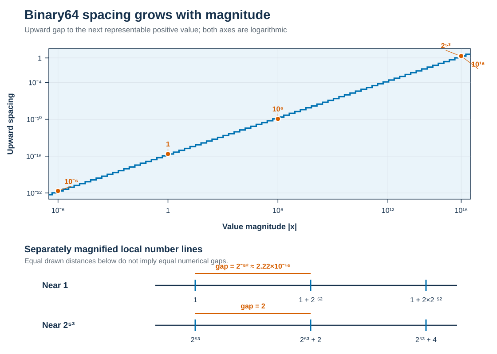

# Module 2: Understanding Floating-Point Arithmetic

## Motivation

In Module 1, two algebraically equivalent variance formulas produced different
answers. The programs ran successfully, the inputs were the same, and both
results looked plausible. An exact reference and an invariant identified the
defensible result, but they did not explain the discrepancy.

The missing idea is that a computer does not perform arithmetic over all real
numbers. A floating-point format stores a finite set of values, and most input
conversions and arithmetic operations must choose a representable result. Those
choices are systematic rather than random, so we can reason about when they
matter.


## Learning outcomes

After this module, you should be able to:

* explain sign, significand, exponent, and finite precision conceptually;
* compare how common binary16, bfloat16, binary32, and binary64 formats trade
  significand precision against exponent range;
* use the spacing between representable values to predict when information can
  be lost;
* explain why rounding occurs during a sequence of operations, not only when a
  result is printed;
* recognize normal numbers, subnormal numbers, signed zero, infinity, and
  `NaN` as distinct numerical states;
* explain the causes of overflow and underflow;
* demonstrate why algebraically equivalent expressions can compute differently.


## Connection to Module 1

[Module 1](01-when-correct-code-produces-wrong-answers.md) introduced a workflow
for investigating suspicious results. Its variance experiment held the exact
inputs and scientific decision fixed, then used a reference calculation and
shift invariance as evidence. This module supplies the arithmetic model needed
to explain the observed behaviour.

We will not yet decide how large an acceptable discrepancy should be. That
requires scale-aware error measures and a scientific accuracy requirement,
which belong to Module 3.


## A finite model of real numbers

A nonzero **normal floating-point number** can be described conceptually as

$$
x = (-1)^s \times m \times b^e,
$$

where:

* $s$ determines the sign;
* $m$ is the **significand**, which carries the significant digits;
* $b$ is the base, usually 2 for scientific-computing hardware;
* $e$ is the exponent, which scales the value by a power of the base.

The significand determines the available **precision**: how much detail can be
retained at a particular scale. The exponent determines much of the **range**:
how small or large a magnitude can be represented. Precision and range are
different resources; a format can cover enormous magnitudes without keeping
every integer or fraction within that range.

The examples in this course use Python's `float` in the published course
environment. It is an IEEE 754 binary64 value with 53 bits of significand
precision for normal numbers. One bit records the sign, an exponent field
selects the scale, and a fraction field records the significant binary digits.
The exact bit layout is useful for some systems work, but it is not necessary
for the reasoning in this course.


## The same model supports different format trade-offs

Scientific software does not always use binary64. Binary32 is common when
memory capacity, data movement, or arithmetic throughput matter, provided that
the resulting accuracy is adequate. Accelerators and some CPUs also support
16-bit formats. The phrase “16-bit floating point” is incomplete because two
important formats allocate those bits differently.

The table compares properties relevant to numerical reasoning. Significand
precision includes the implicit leading bit of a normal value; it is therefore
one greater than the stored fraction-field width.

| Format | Significand precision | Exponent bits | Gap above 1 | Positive normal range |
|---|---:|---:|---:|---:|
| binary16 | 11 bits | 5 | $2^{-10}\approx9.77\times10^{-4}$ | approximately $6.10\times10^{-5}$ to $6.55\times10^4$ |
| bfloat16 | 8 bits | 8 | $2^{-7}=7.8125\times10^{-3}$ | approximately $1.18\times10^{-38}$ to $3.39\times10^{38}$ |
| binary32 | 24 bits | 8 | $2^{-23}\approx1.19\times10^{-7}$ | approximately $1.18\times10^{-38}$ to $3.40\times10^{38}$ |
| binary64 | 53 bits | 11 | $2^{-52}\approx2.22\times10^{-16}$ | approximately $2.23\times10^{-308}$ to $1.80\times10^{308}$ |

Binary16, binary32, and binary64 are IEEE 754 binary interchange formats.
Bfloat16 is a different 16-bit layout, not another name for binary16. It keeps
the exponent width of binary32, and therefore approximately its normal range,
but retains only eight bits of significand precision. Binary16 retains more
detail near one but has a much smaller exponent range.

{fig-alt="Panel A shows the endian-independent logical layouts of binary16, bfloat16, binary32, and binary64: one sign bit, then exponent and stored fraction fields of different widths. Panel B groups those fields into bytes from low to high addresses for a little-endian system. It emphasizes that byte order changes but all bits are not simply reversed."}

The upper panel is the logical representation, conventionally written from the
most-significant bit to the least-significant bit. This field order does not
depend on endianness. The lower panel shows how the same bits occupy bytes in
increasing memory-address order on a little-endian system: the least-significant
byte is stored first. Bits within each byte are still drawn in the conventional
bit-7-to-bit-0 direction. Little endian therefore changes byte order; it does
not reverse the complete string of bits.

The blue field contains the **stored fraction**, not the complete significand.
For a normal value the leading significand bit is implicit, which is why the
precision $p$ in the table and figure is one greater than the stored fraction
width. Subnormal values do not have that implicit leading one, and exponent
patterns at the extremes encode zeros, infinities, and NaNs rather than ordinary
scaled significands.

Two probes expose the trade-off:

* Near one, binary16 can distinguish `1.001` from `1`, whereas bfloat16 rounds
  `1.001` to `1` under round-to-nearest, ties-to-even.
* The value $10^{-20}$ is far below even the binary16 subnormal range and rounds
  to zero there. It lies within the normal range of bfloat16, binary32, and
  binary64.

Likewise, every consecutive integer is representable through $2^p$, where $p$
is the significand precision. At that threshold, adding one can already round
back to the original value: $2^8$ for bfloat16, $2^{11}$ for binary16,
$2^{24}$ for binary32, and $2^{53}$ for binary64. Some larger integers remain
representable, but not every integer does.

These observations do not rank one format as universally best. A narrower
format can reduce storage, data movement, and sometimes runtime or energy use,
but it also changes rounding, overflow, underflow, and the attainable accuracy.
Those consequences must be tested against the scientific requirement. Module 8
will additionally distinguish the format used to store a value from the
formats used for products and accumulations.

The model immediately has an important consequence: only finitely many values
are representable. The decimal fraction $0.1$, for example, has no finite
binary expansion. Converting it to binary64 selects a nearby representable
value:

```text
entered decimal:       0.1
stored value shown to 17 significant digits: 0.10000000000000001
exact stored fraction: 3602879701896397 / 36028797018963968
```

The usual short display `0.1` is chosen because it converts back to the same
stored value. Printing more digits exposes the approximation; it does not
improve it.


## Before the companion experiment

The [floating-point landmarks](../notebooks/02-floating-point-landmarks.qmd)
notebook explores the finite number line using only Python's standard library.
Before running it, record your predictions:

1. Is the distance to the next representable number the same near $10^{-6}$,
   $1$, and $10^{16}$?
2. Will binary16 and bfloat16 make the same choices for both `1.001` and
   $10^{-20}$?
3. For $x=2^{53}$, will `x + 1.0` differ from `x`?
4. Will `(a + b) + c` always equal `a + (b + c)`?
5. Is `NaN` equal to itself?

Preview the authoritative Quarto source from the repository root with:

```bash
quarto preview notebooks/02-floating-point-landmarks.qmd
```

The complete site build also generates a downloadable Jupyter notebook.


## Representable values are unevenly spaced

Imagine the representable values as marked points on a number line. A real
number between two marks must be approximated by one of the available points.
For normal binary floating-point values, the marks are close together near zero
and farther apart at large magnitudes.

Python's `math.nextafter(x, math.inf)` returns the next representable value
larger than `x`. In the course environment, the upward spacing changes as
follows:

| Value $x$ | Next larger value minus $x$ |
|---:|---:|
| $10^{-6}$ | approximately $2.12\times10^{-22}$ |
| $1$ | approximately $2.22\times10^{-16}$ |
| $10^6$ | approximately $1.16\times10^{-10}$ |
| $2^{53}$ | $2$ |
| $10^{16}$ | $2$ |

{#fig-binary64-spacing}

Both axes in @fig-binary64-spacing are logarithmic because the displayed values
and gaps span many orders of magnitude. The staircase is intentional: the
absolute spacing is constant within each normal exponent interval and doubles
at a power-of-two boundary. The two number lines are magnified independently;
they compare local structure and do not share one linear scale.

The spacing is not a single fixed decimal resolution. Within each normal binary
scale interval, the absolute spacing is fixed; when the exponent increases,
the spacing grows. The relative spacing remains of a similar order throughout
the normal range.

An **ulp**, or *unit in the last place*, describes spacing at a particular
floating-point value. Python's `math.ulp(x)` exposes this local scale. At
$x=1$, it returns approximately $2.22\times10^{-16}$, which is also
`sys.float_info.epsilon`: the gap between 1 and the next larger binary64 value.

Machine epsilon characterizes a format near 1. It is not a universal tolerance
for comparing arbitrary results. The same absolute difference can be tiny at
one scale, enormous at another, or decisive near a scientific threshold.
Module 3 develops comparison rules that account for that context.


## Rounding happens locally

For a basic arithmetic operation, a useful working model is:

1. consider the exact mathematical result of the operation;
2. if that result is representable, store it exactly;
3. otherwise, select a nearby representable value according to the active
   rounding rule.

The usual IEEE 754 rule is **round to nearest, ties to even**. A result is
rounded to the nearest representable value; an exact halfway case is resolved
so that the least significant retained digit is even. Other rounding modes
exist, but the course examples assume the usual default.

Rounding is local because it occurs after individual operations. A later
operation receives the already-rounded operand; it does not have access to the
discarded information. Consequently, rounding at an early stage may have no
visible effect, may be offset by later rounding, or may influence the final
result.

At $x=2^{53}$, adjacent binary64 values are two units apart. The exact value
$x+1$ lies halfway between two representable values, so the default tie rule
rounds it back to $x$:

```text
x + 1.0 == x      -> True
x + 2.0 == x      -> False
```

The value `1.0` has not become zero. It is too small to change the stored result
at that scale. This is why a test such as `x + small == x` must be interpreted
in terms of the format and the magnitude of `x`.


## Numerical states at the limits

IEEE 754 formats reserve representations for values and states that do not fit
the ordinary normal-number model.

| State | Meaning | Important behaviour |
|---|---|---|
| Normal finite number | A nonzero value represented with the format's full significand precision | Most routine floating-point values are normal. |
| Subnormal number | A nonzero value smaller in magnitude than the smallest normal value | Subnormals provide gradual underflow, but retain fewer significant bits as they approach zero. |
| Positive or negative zero | A zero with a retained sign | `0.0 == -0.0` is true, but the sign can affect some functions and limiting operations. |
| Positive or negative infinity | A value beyond the finite range, or an explicitly constructed infinity | Arithmetic can propagate infinity; some operations involving infinities are invalid. |
| `NaN` | “Not a Number,” used for an invalid or indeterminate numerical result | `NaN` propagates through many operations and is not equal to itself. |

For binary64, the largest finite value is approximately
$1.80\times10^{308}$. A result whose magnitude is too large for the finite
range **overflows**. Depending on the language, operation, and runtime policy,
overflow may produce infinity, raise an exception, set a status flag, or issue
a warning.

The smallest positive normal binary64 value is approximately
$2.23\times10^{-308}$. Smaller nonzero results may enter the subnormal range,
where precision gradually decreases. A result too small even for that range
rounds to a signed zero. These outcomes occupy the **underflow region**;
underflow is not limited to the final transition to zero. IEEE 754 status
signalling additionally depends on whether a tiny result is inexact.

Special values should be classified rather than hidden. In Python,
`math.isfinite`, `math.isinf`, and `math.isnan` express the intended checks.
Testing `value == float("nan")` does not work because every ordered comparison
with `NaN` is false, equality with itself is false, and inequality is true.
Language behaviour also matters: Python raises an exception for floating-point
division by zero even though the underlying format includes infinities.


## Real-number algebra is not always computational algebra

Associativity says that changing the grouping of additions does not change the
result over the real numbers. Floating-point addition does not generally
preserve that identity because each grouped operation can round differently.
For example, let

```text
a = 1e16
b = -1e16
c = 1.0
```

Then binary64 arithmetic in the course environment gives:

| Expression | Computed result |
|---|---:|
| `(a + b) + c` | `1.0` |
| `a + (b + c)` | `0.0` |

In the first expression, `a + b` is exactly zero, so adding `c` produces one.
In the second, adding `c` to `b` does not change the stored value at that scale;
the subsequent addition therefore produces zero. Both expressions equal one in
exact real arithmetic, but their sequences of intermediate floating-point
operations differ.

This does not mean algebra is useless. It means an algebraic rewrite can change
the computation, and the consequences must be checked rather than assumed.


## Explaining the opening variance discrepancy

The centered variance formula first subtracts the mean. For the Module 1 data,
the mean is $100{,}000{,}010\ \mathrm{ns}$ and the centered values are
$[-6,-3,3,6]\ \mathrm{ns}$. Its subsequent arithmetic therefore operates on
quantities near the scale of the spread.

The shortcut formula computes a mean of squared timestamps and the square of
the mean. Both intermediate values are near $10^{16}\ \mathrm{ns}^2$, where
adjacent binary64 values are $2\ \mathrm{ns}^2$ apart. Each intermediate is
rounded before they are subtracted. Although their exact difference is
$22.5\ \mathrm{ns}^2$, the rounded intermediates no longer retain enough
information to recover that value, and their computed difference is
$22.0\ \mathrm{ns}^2$.

The two formulas are mathematically equivalent but not computationally
equivalent in binary64 arithmetic. This explanation is consistent with the
Module 1 evidence: changing the common timestamp offset increases the scale of
the shortcut formula's intermediates without changing the variance itself.

The example does not establish that every centered calculation is reliable for
every input, nor that every algebraic rearrangement is harmful. It shows why an
implementation must be evaluated as a sequence of finite-precision operations,
not only as an expression over real numbers.


## What this model does and does not establish

The spacing experiments, lost increment, changed evaluation order, and variance
intermediates are all predicted by the finite-set model. That agreement gives
us a coherent explanation rather than a collection of surprising outputs.

The model used here has deliberate limits:

* Except for the explicitly labelled format comparison, the numerical values
  shown assume IEEE 754 binary64 and the default rounding mode used by the
  published Python environment.
* Other types may have a different base, precision, range, or special-value
  policy.
* The notebook's bfloat16 helper models a declared conversion path; it does not
  establish the arithmetic or performance of untested hardware or libraries.
* Languages, libraries, and compilers can differ in how they report exceptional
  states and in whether they combine particular operations.
* Knowing why two results differ does not determine whether the difference is
  acceptable for a scientific purpose.

The last point is essential. Floating-point arithmetic explains a source of
discrepancy; it does not supply a validation threshold.


## Questions to ask about a floating-point computation

* Which floating-point format or numeric type is being used?
* Does its allocation of significand and exponent bits provide enough local
  precision and range for the relevant values?
* Are the input values exactly representable, or are they rounded during
  conversion?
* What is the local spacing at the magnitudes of important inputs and
  intermediate results?
* Can a small contribution be rounded away when combined with a much larger
  value?
* Could an intermediate result overflow, become subnormal, or underflow to
  zero even if the final mathematical result is finite?
* Could regrouping or reformulating the operations change which information is
  retained?
* Are `NaN`, infinity, and signed zero detected and handled according to the
  scientific meaning of the calculation?


## Reflection questions

1. Why can Python display `0.1` even though the exact stored binary64 value is
   slightly different?
2. At $x=2^{53}$, why does `x + 1.0 == x` not imply that `1.0` is zero?
3. Why can changing parentheses alter a floating-point sum?
4. What is the difference between overflow and underflow?
5. How does local spacing explain the failure of the shortcut variance formula?
6. Why should `sys.float_info.epsilon` not be copied directly into every
   numerical comparison?
7. Why can bfloat16 represent $10^{-20}$ as a normal value while binary16
   rounds it to zero, even though both formats use 16 bits?

::: {.callout-note collapse="true"}
## Suggested answers

1. Python normally prints the shortest decimal text that converts back to the
   same stored value. The display hides unnecessary digits; it does not claim
   that the decimal fraction is represented exactly.
2. The spacing at that magnitude is two. The exact sum lies between
   representable values and rounds back to `x` under the default rule.
3. Each grouping creates a different sequence of intermediate results, and each
   intermediate may be rounded before the next operation.
4. Overflow occurs when a magnitude is too large for the finite range.
   Underflow occurs when a nonzero magnitude is too small for normal
   representation and may produce a subnormal value or signed zero.
5. The shortcut creates intermediate values near $10^{16}\ \mathrm{ns}^2$,
   where the spacing is $2\ \mathrm{ns}^2$. Rounding those values before their
   subtraction loses information needed to recover the exact variance.
6. Machine epsilon describes spacing near one for a particular format. A
   defensible comparison must also account for the scale of the values and the
   accuracy required by the scientific question.
7. Bfloat16 devotes eight bits to the exponent, giving it approximately the
   normal range of binary32. Binary16 uses only five exponent bits and spends
   more of its 16-bit budget on significand precision. Equal storage width does
   not imply equal range or spacing.
:::


## Takeaways

* Floating-point values form a finite, nonuniformly spaced approximation to the
  real numbers; precision and range are distinct.
* Binary16 and bfloat16 demonstrate that the same storage width can encode very
  different precision-and-range trade-offs; the format must be named.
* Conversion and arithmetic round locally, so small contributions can disappear
  and evaluation order can change a result.
* Subnormal numbers, signed zero, infinity, and `NaN` are meaningful observable
  states that should be classified explicitly.
* A finite-precision model can explain a discrepancy, but it cannot decide
  whether that discrepancy is scientifically acceptable.


## Connection to the next module

We can now explain why two floating-point computations may differ.
[Module 3: Measuring And Comparing Numerical Error](03-measuring-and-comparing-numerical-error.md)
introduces absolute, relative, and mixed comparisons for deciding whether a
difference matters at the relevant scale.
