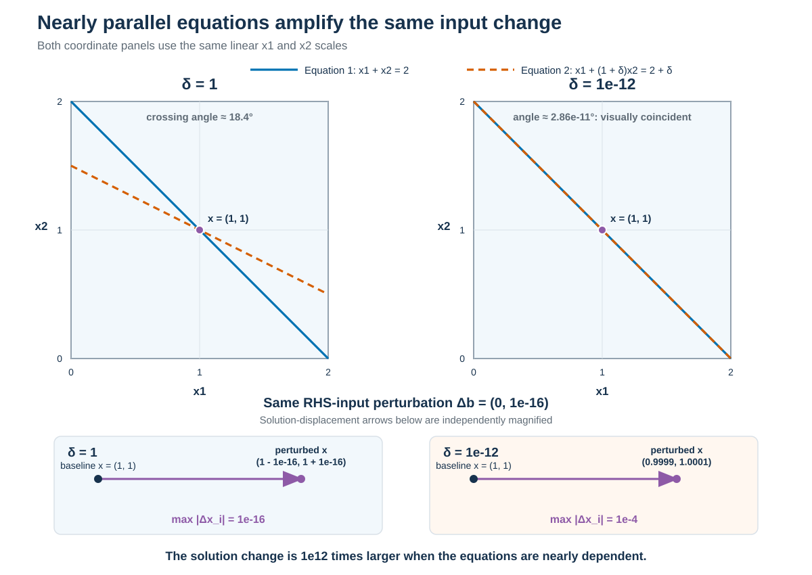

# Module 4: Conditioning And Numerical Stability

## Motivation

Suppose a computed result fails the comparison defined in Module 3. Increasing
the tolerance would merely weaken the requirement; it would not identify what
went wrong. A useful remedy depends on the cause.

Two causes are easy to confuse. The mathematical problem may be intrinsically
sensitive, so small changes in measured or represented inputs necessarily
produce large output changes. Alternatively, the problem may permit an accurate
answer while the selected algorithm loses much more information than necessary.
A third possibility is simpler: the program does not implement the intended
algorithm.

These cases call for different responses. Better arithmetic cannot recover
information absent from uncertain inputs, while better measurements do not fix
an unreliable algorithm or an indexing defect.


## Learning outcomes

After this module, you should be able to:

* describe conditioning as input-to-output sensitivity for a stated problem,
  input, norm, and scale;
* distinguish problem conditioning from algorithmic stability and
  implementation correctness;
* use controlled perturbations to estimate directional sensitivity;
* propagate small deterministic input bounds or standard uncertainties through
  a smooth model, while stating the assumptions behind the result;
* interpret forward error, backward error, and residuals as different
  questions;
* explain why a small residual need not imply a small forward error;
* select evidence and remedies that match the diagnosed source of error.


## Connection to Module 3

[Module 3](03-measuring-and-comparing-numerical-error.md) established how to
measure a discrepancy and judge it against a defensible requirement. This
module assumes those choices are already explicit: the reference, units, norm
or scalar metric, and tolerance are known.

We now ask why the discrepancy occurs. Scale-aware error measures must come
first because conditioning and stability compare *relative sizes*: input
changes, output changes, forward errors, backward errors, and residuals. A
diagnosis is meaningless if those quantities have not been defined.


## Three questions, three objects

| Question | Object being assessed | Evidence |
|---|---|---|
| How sensitive is the answer to the input? | The mathematical problem at a specified input | Deliberate input perturbations, analytic bounds, or a condition estimate |
| Does the algorithm introduce more error than the problem requires? | The algorithm for a specified input range and arithmetic | Forward and backward error, precision changes, or comparison with a better formulation |
| Does the program perform the intended algorithm? | The implementation | Specification-based tests, known cases, invariants, and code review |

**Conditioning** belongs to the mathematical problem, not to a particular
program. **Stability** describes an algorithm's numerical behaviour; it is not
the same as whether the source code is free of defects. A program can faithfully
implement an unstable algorithm, or incorrectly implement a stable one.


## Conditioning measures problem sensitivity

Consider a problem that maps input data $b$ to a result $x$. Change the input by
$\Delta b$ and observe a corresponding output change $\Delta x$. A directional
relative amplification is

$$
\kappa_\mathrm{obs} =
\frac{\|\Delta x\|/\|x\|}
     {\|\Delta b\|/\|b\|}.
$$

A **norm** is a rule that turns a vector into one nonnegative measure of its
size. The norm and scaling are part of the definition. This module uses the
**maximum norm**, $\|v\|_\infty=\max_i|v_i|$: take the absolute value of every
component and select the largest. For example,
$\|(-3,4,1)\|_\infty=4$. The
[vectors, norms, and scaling reference](reference-vectors-norms-and-scaling.md)
compares this choice with other common norms.

Here the maximum norm is applied to dimensionless, nondimensionalized
quantities. If components have different units or meaningful scales, they must
be scaled before one relative measure can be interpreted.

A formal local condition number describes the largest amplification over all
sufficiently small perturbation directions. One experiment gives an observed
directional amplification, not a proof of that worst case. It can nevertheless
reveal severe sensitivity.

A **well-conditioned** problem has modest amplification for the perturbations
that matter. An **ill-conditioned** problem can amplify input uncertainty or
rounding so strongly that the requested output accuracy is unattainable.
Conditioning is not a binary label: it depends on the input, the chosen output,
the perturbation model, and the norm.


## A two-equation sensitivity experiment

This experiment instantiates the preceding definition. For each fixed positive
$\delta$, define a mathematical map $f_\delta:b\mapsto x$ by solving the
dimensionless system

$$
\begin{aligned}
x_1+x_2 &= b_1,\\
x_1+(1+\delta)x_2 &= b_2.
\end{aligned}
$$

The **input** is the right-hand-side vector $b=(b_1,b_2)$; the **output** is the
exact solution vector $x=(x_1,x_2)$. The parameter $\delta$ selects which map is
being examined and is held fixed during each perturbation experiment. If
$\delta$ were itself uncertain, the coefficient data would also have to be
included in the input, but that is a different conditioning question.

Use the baseline input

$$
b_\delta=(2,2+\delta),
$$

for which $f_\delta(b_\delta)=(1,1)$. Now change only the second component of
the input by $\eta$:

$$
\Delta b=(0,\eta),
\qquad
\widetilde b_\delta=b_\delta+\Delta b=(2,2+\delta+\eta).
$$

Solving the perturbed system exactly gives

$$
\widetilde x_2=1+\frac{\eta}{\delta},
\qquad
\widetilde x_1=1-\frac{\eta}{\delta},
$$

so $\Delta x=(-\eta/\delta,\eta/\delta)$. In the maximum norm used above,

$$
\frac{\|\Delta b\|_\infty}{\|b_\delta\|_\infty}
=\frac{|\eta|}{2+\delta},
\qquad
\frac{\|\Delta x\|_\infty}{\|x\|_\infty}
=\frac{|\eta|}{\delta}.
$$

Substitution into the preceding definition connects the experiment directly to
the observed directional amplification:

$$
\kappa_\mathrm{obs}=\frac{2+\delta}{\delta}.
$$

The same absolute right-hand-side perturbation is used for each map, but its
effect on the solution grows as $\delta$ decreases. With $\eta=10^{-16}$,
high-precision decimal arithmetic gives:

| $\delta$ | Relative RHS-input change | Relative solution-output change | Observed amplification |
|---:|---:|---:|---:|
| $1$ | approximately $3.33\times10^{-17}$ | $10^{-16}$ | approximately $3$ |
| $10^{-12}$ | approximately $5.00\times10^{-17}$ | $10^{-4}$ | approximately $2.00\times10^{12}$ |

Reducing $\delta$ makes the two left-hand sides nearly identical, so the problem
has little information with which to distinguish $x_1$ from $x_2$. For each
table row, however, $\delta$ is fixed and only the declared input $b$ changes.
The large output change is therefore evidence of sensitivity of the
mathematical map, not binary64 rounding: the experiment uses high-precision
decimal arithmetic and the amplification follows directly from the equations.
It measures one perturbation direction, not the worst-case condition number.

{fig-alt="Two coordinate-plane panels share linear axes from zero to two. For delta equal to one, the two equation lines cross at a visible angle. For delta equal to ten to the minus twelve, the lines are visually coincident. Independently magnified arrows below show that the same right-hand-side perturbation produces maximum-norm solution changes of ten to the minus sixteen and ten to the minus four, respectively."}

The upper panels use identical coordinate scales. The near overlap for
$\delta=10^{-12}$ is therefore the geometric evidence: the two equations
constrain almost the same direction. Their small angular difference cannot be
resolved at this scale. The lower displacement arrows are deliberately and
independently magnified; their labels, rather than their drawn lengths, give the
quantitative comparison. The same input perturbation produces a solution change
$10^{12}$ times larger in the nearly dependent system.


## Propagation combines sensitivity with input information

Conditioning asks how strongly a mathematical model *could* amplify input
changes. Propagation combines that sensitivity with a declared description of
which input changes are possible or plausible.

The word **error** needs care here. For a synthetic test with a known exact
input, the input error can be calculated. For measured data, the unknown true
value is usually unavailable. What can be propagated is instead a stated input
bound, standard uncertainty, covariance, probability distribution, or set of
admissible values. These descriptions are not interchangeable.

Let a scalar result be

$$
y=f(x_1,x_2,\ldots,x_n).
$$

For sufficiently small input changes and a differentiable model, first-order
linearization gives

$$
\Delta y
\approx
\sum_{i=1}^n c_i\Delta x_i,
\qquad
c_i=\left.\frac{\partial f}{\partial x_i}\right|_{x_1,\ldots,x_n}.
$$

The derivatives $c_i$ are **sensitivity coefficients**. Their units convert a
change in each input into a change in the output. They may be derived
analytically, computed with automatic differentiation, or estimated with
carefully scaled and checked numerical perturbations.

For small deterministic bounds $|\Delta x_i|\le b_i$, adding the magnitudes of
the linearized contributions gives the first-order estimate

$$
|\Delta y|
\lesssim
\sum_{i=1}^n |c_i|b_i.
$$

This expression explains the familiar arithmetic rules:

| Operation | Small-change first-order estimate |
|---|---|
| $y=a\mathbin{+}b$ or $y=a-b$ | $|\Delta y|\lesssim |\Delta a|+|\Delta b|$ |
| $y=ab$ or $y=a/b$ | $|\Delta y/y|\lesssim |\Delta a/a|+|\Delta b/b|$ |
| $y=a^p$ | $|\Delta y/y|\lesssim |p|\,|\Delta a/a|$ |

The product, quotient, and power expressions are local approximations, not
rigorous bounds for arbitrary input ranges. A rigorous deterministic envelope
requires bounding the nonlinear remainder or evaluating the complete
admissible input set with a justified method.


## Worked example: density from bounded inputs

Suppose mass and volume are known only to lie in the ranges

$$
m\in[99.8,100.2]\ \mathrm{g},
\qquad
V\in[39.7,40.3]\ \mathrm{cm^3},
$$

and the model is $\rho=m/V$. At the nominal inputs,
$\rho=2.5\ \mathrm{g\,cm^{-3}}$. Because density increases with $m$ and
decreases with positive $V$, the exact extrema over this rectangular input set
occur at opposite corners:

$$
\frac{99.8}{40.3}
\le \rho \le
\frac{100.2}{39.7},
$$

or

$$
2.47643
\le \rho \le
2.52393\ \mathrm{g\,cm^{-3}}.
$$

The first-order relative estimate is

$$
\frac{|\Delta\rho|}{\rho}
\lesssim
\frac{0.2}{100.0}+\frac{0.3}{40.0}
=0.0095,
$$

which gives $|\Delta\rho|\lesssim0.02375\ \mathrm{g\,cm^{-3}}$. The exact
deviations are asymmetric: approximately
$-0.02357$ and $+0.02393\ \mathrm{g\,cm^{-3}}$. The first-order result is a
useful scale estimate here, but its slight miss at the upper endpoint shows why
it must not be presented as an exact bound.


## Standard uncertainties require covariance

Now make a different statement: suppose $0.2\ \mathrm{g}$ and
$0.3\ \mathrm{cm^3}$ are **standard uncertainties**, rather than interval
half-widths. Let $\Sigma_x$ be the input covariance matrix and let the row
vector $J=[c_1,\ldots,c_n]$ contain the sensitivity coefficients. First-order
propagation gives

$$
u_c^2(y)\approx J\Sigma_xJ^\mathsf{T}
=
\sum_{i=1}^n\sum_{j=1}^n
c_i c_j\operatorname{Cov}(X_i,X_j).
$$

If the inputs are independent, the covariance terms vanish and this reduces to

$$
u_c(y)\approx
\sqrt{\sum_{i=1}^n\left(c_i u(x_i)\right)^2}.
$$

For the density example, treating the stated values as independent standard
uncertainties gives

$$
u_c(\rho)
\approx
2.5\sqrt{
\left(\frac{0.2}{100.0}\right)^2+
\left(\frac{0.3}{40.0}\right)^2}
=0.0194\ \mathrm{g\,cm^{-3}}.
$$

This is not the deterministic interval calculated above, nor is it
automatically a confidence interval. It is an estimated standard uncertainty
under a different input model. Correlation also matters: because increasing
mass raises the density while increasing volume lowers it, positive covariance
between $m$ and $V$ reduces this first-order variance, while negative covariance
increases it. Omitting a shared calibration effect can therefore make the
result wrong in either direction.


## Relate propagation to conditioning

For nonzero scalar inputs and output, define componentwise relative sensitivity
coefficients

$$
\kappa_i=
\left|\frac{x_i}{y}\frac{\partial f}{\partial x_i}\right|.
$$

Then the deterministic first-order estimate can be written as

$$
\left|\frac{\Delta y}{y}\right|
\lesssim
\sum_{i=1}^n
\kappa_i\left|\frac{\Delta x_i}{x_i}\right|.
$$

This is the connection between conditioning and propagation. The
$\kappa_i$ describe local amplification by the model; the declared input bounds
or uncertainties describe how strongly each direction is excited. A large
condition number is a warning about possible amplification, but it is not by
itself an output uncertainty.


## Know when first-order propagation is inadequate

Linearization is most credible when the model is smooth, the input uncertainty
is small enough that one local derivative is representative, and the output is
not near a singularity, branch change, or discontinuity. It should be checked
when those conditions are doubtful.

For example, let $Y=X^2$ with nominal input $x=0$ and nonzero standard
uncertainty $u(x)$. The derivative at the nominal input is zero, so first-order
propagation reports zero output uncertainty. That conclusion is false: plausible
nonzero values of $X$ produce positive values of $Y$. Higher-order analysis or
direct propagation is required.

Practical alternatives include:

* evaluate all corners when monotonicity or linearity proves that extrema occur
  there;
* use interval or optimization methods when a defensible deterministic bound is
  required, while checking dependency and overestimation effects;
* sample a justified joint input distribution and run the model repeatedly to
  approximate the output distribution;
* compare direct propagation with the linearized result to assess whether
  nonlinearity matters.

Monte Carlo propagation is often workable for complicated models, but it does
not repair an unjustified input distribution, omitted correlation, model
discrepancy, or insufficient sampling of rare events. It estimates a
distribution; it does not automatically provide a rigorous worst-case bound.


## Before the companion experiment

The [sensitivity, stability, and residuals](../notebooks/04-sensitivity-stability-residuals.qmd)
notebook reproduces the two-equation perturbation in high precision, compares
two quadratic-root algorithms, and constructs a candidate solution with a tiny
residual but a large forward error.

Before running it, predict:

1. how the amplification changes as $\delta$ decreases;
2. whether two algebraically equivalent root formulas have the same error;
3. whether a candidate with a relative residual near $10^{-13}$ must be close
   to the exact solution;
4. which observation diagnoses the problem, the algorithm, or the
   implementation.

Preview the authoritative Quarto source from the repository root with:

```bash
quarto preview notebooks/04-sensitivity-stability-residuals.qmd
```

The complete site build also generates a downloadable Jupyter notebook.


## Forward and backward error can be defined formally

Let $d$ denote the supplied problem data and let $S(d)$ be the set of exact
solutions for those data. For a computed result $\hat{x}$, define the forward
error by

$$
e_{\mathrm{fwd}}(\hat{x};d)
=
\inf_{x\in S(d)} \rho_X(\hat{x},x),
$$

where $\rho_X$ measures distance in the solution space. If the problem has a
unique exact solution $x$, a common relative normwise choice is

$$
e_{\mathrm{fwd,rel}}(\hat{x};d)
=
\frac{\|\hat{x}-x\|_X}{\|x\|_X},
\qquad x\ne 0.
$$

For a problem with multiple solutions, $S(d)$ must contain the solutions that
are acceptable for the scientific question. If a particular solution branch
is intended, measuring the distance to any other branch could understate the
error. An absolute or component-scaled measure is needed when a relative norm
is undefined or inappropriate, for example when $x=0$ or components have
different units. When $x$ is approximated by a high-precision or independent
reference, the result is a measured forward-error estimate rather than the
unknown exact forward error, and the reference must be justified.

The backward error instead measures distance in the data space. Define it by

$$
\eta(\hat{x};d)
=
\inf_{\Delta d\ \text{admissible}}
\left\{
\rho_D(d,d+\Delta d)
\;:\;
\hat{x}\in S(d+\Delta d)
\right\}.
$$

Here $\Delta d$ ranges only over **admissible perturbations**: changes that
preserve whatever structure belongs to the problem, such as matrix symmetry,
positive parameters, or fixed coefficients. The function $\rho_D$ measures
the size of the data change. For nonzero data, a common normwise relative
choice is

$$
\rho_D(d,d+\Delta d)=\frac{\|\Delta d\|_D}{\|d\|_D},
$$

but an absolute or component-scaled measure may be more meaningful when some
data are zero, have different units, or vary over very different scales. If no
admissible perturbation makes $\hat{x}$ exact, the backward error is infinite.
Thus a numerical value for backward error is meaningful only together with its
data, perturbation model, norm, and scaling.

For example, consider $Ax=b$ with $A$ held fixed. If
$r=b-A\hat{x}$, then $\hat{x}$ exactly solves the nearby problem

$$
A\hat{x}=b+\Delta b,
\qquad \Delta b=-r.
$$

Under a relative normwise perturbation of the right-hand side, the backward
error is therefore

$$
\eta_b(\hat{x};A,b)
=
\frac{\|r\|}{\|b\|},
\qquad b\ne 0.
$$

Allowing perturbations in $A$ as well would define a different backward error;
that choice must be stated rather than assumed.

The two definitions expose the central contrast:

* forward error asks how far $\hat{x}$ is from an acceptable exact solution;
* backward error asks how far the supplied data must move to make $\hat{x}$
  exact.


## Stability measures algorithmic behaviour

An algorithm is **backward stable** for a stated class of inputs when every
computed answer has a small backward error under the selected perturbation
model. In floating-point analysis this is often expressed as
$\eta(\hat{x};d)\le C u$, where $u$ is the unit roundoff and $C$ is a modest
factor that may depend on the problem size or input class. This asks whether
the algorithm behaves as if it introduced only a small disturbance to the
supplied data; it does not assert that the computed answer is close to the
desired answer.

Backward stability does not guarantee small forward error. If the problem is
ill-conditioned, a tiny backward error can be amplified into a large output
error. Under suitable assumptions, the relationship is summarized by the
first-order guide

$$
\text{relative forward error}
\lesssim
\text{condition number}\times\text{relative backward error}.
$$

This is a reasoning pattern, not a universal equality. The precise bound
depends on the problem, norm, perturbation model, and whether the changes are
small enough for a local approximation.

Stability is also scoped. An algorithm may behave well for one input range and
poorly for another, or in one arithmetic format and not another. Evidence from
a constructed case supports a bounded claim rather than a timeless label.


## Holding the problem fixed exposes algorithmic error

Consider the dimensionless quadratic

$$
x^2-Bx+1=0,
\qquad B=10^8.
$$

The smaller root can be evaluated directly as

$$
x_\mathrm{direct}=\frac{B-\sqrt{B^2-4}}{2}.
$$

The product of the two exact roots is one. We can therefore compute the large
root with the addition in the numerator and obtain the small root from its
reciprocal:

$$
x_\mathrm{reformulated}
=\frac{1}{(B+\sqrt{B^2-4})/2}
=\frac{2}{B+\sqrt{B^2-4}}.
$$

An 80-digit decimal reference, checked against a 100-digit recomputation, is
approximately $1.0000000000000001\times10^{-8}$. Binary64 results are:

| Method | Computed small root | Relative forward error | Relative coefficient backward error |
|---|---:|---:|---:|
| Direct formula | $7.450580596923828\times10^{-9}$ | approximately $2.55\times10^{-1}$ | approximately $1.46\times10^{-1}$ |
| Reformulated formula | $1.0\times10^{-8}$ | approximately $7.91\times10^{-17}$ | approximately $3.95\times10^{-17}$ |

For a computed root $\hat{x}$, the polynomial residual is
$p(\hat{x})=\hat{x}^2-B\hat{x}+1$. The coefficient backward-error measure used
in the table is

$$
\eta_p=
\frac{|p(\hat{x})|}
     {|\hat{x}|^2+B|\hat{x}|+1}.
$$

It measures the relative coefficient perturbation needed to make the candidate
an exact root under this component-scaled model. The problem and binary64
format are identical for both methods, but their forward and backward errors
differ by many orders of magnitude. The algorithmic formulation therefore
matters.

This example contains a recognizable arithmetic failure pattern. Module 5
names that pattern, shows where else it appears, and develops a broader set of
mitigations. Here the purpose is to distinguish problem sensitivity from
algorithmic behaviour.


## Forward error, backward error, and residual answer different questions

Suppose $Ax=b$ and a program returns $\hat{x}$.

* **Forward error** compares $\hat{x}$ with the desired solution $x$. A relative
  max-norm measure is
  $\|\hat{x}-x\|_\infty/\|x\|_\infty$. It requires a justified reference for
  $x$.
* The **residual** is $r=b-A\hat{x}$. It tests how well the candidate satisfies
  the supplied equations and has the units of $b$.
* **Backward error** asks how much the input must change to make $\hat{x}$
  exact. If $A$ is fixed, then $\hat{x}$ exactly solves
  $A\hat{x}=b-r$. The relative right-hand-side perturbation is
  $\|r\|_\infty/\|b\|_\infty$.

A residual becomes interpretable only after scaling. “The residual is small”
must say small relative to what and in which norm. Even a properly scaled small
residual does not by itself bound forward error when the problem is
ill-conditioned.


## A small residual can accompany a wrong answer

Return to the two-equation system with $\delta=10^{-12}$. The exact solution is
$x=(1,1)$, but consider the candidate $\hat{x}=(0,2)$. Its diagnostics are:

| Diagnostic | Value |
|---|---:|
| Relative forward error | $1$ |
| Residual $b-A\hat{x}$ | $(0,-10^{-12})$ |
| Relative right-hand-side backward error | approximately $5.00\times10^{-13}$ |

The candidate is completely wrong in one component, yet it exactly solves the
nearby system whose second right-hand side is $2+2\times10^{-12}$ rather than
$2+10^{-12}$. The tiny input change is amplified by the ill-conditioned
problem. This is why residual-based stopping criteria, introduced in Module 6,
must be interpreted using conditioning and a meaningful scale.


## Keep implementation defects separate

Stability analysis assumes that the implementation performs the algorithm being
assessed. A sign error, wrong index, incorrect unit conversion, or unintended
precision conversion can imitate unstable behaviour without saying anything
about the intended algorithm.

Useful implementation evidence includes:

* exact or hand-checkable cases that exercise each code path;
* invariants and structural properties;
* comparison with an independently written implementation;
* tests that verify intermediate quantities, not only program termination;
* code review against the mathematical specification.

If the implementation is wrong, fix and retest it before drawing conclusions
about conditioning or stability.


## Match the experiment to the diagnosis

| Observation or experiment | What it can reveal | What it does not prove alone |
|---|---|---|
| Perturb inputs in high precision | Sensitivity inherent in the mathematical problem | Which finite-precision algorithm is best |
| Hold the problem fixed and compare algorithms | Avoidable differences caused by formulation | That the better method works for every input |
| Recompute in higher precision | Whether arithmetic effects contribute to the discrepancy | That the problem is well-conditioned or the implementation correct |
| Compute forward and backward errors | Whether the answer is accurate and whether it solves a nearby problem | The cause without a condition estimate |
| Check a scaled residual | Whether equations are nearly satisfied | Proximity to the desired solution on an ill-conditioned problem |
| Test known cases and invariants | Implementation fidelity and expected behaviour | A general stability theorem |

Use complementary experiments. A precision sweep, for example, can show that
rounding contributes to an error, while a high-precision input perturbation can
show that uncertain data would still be amplified even if arithmetic were
exact.


## Choose a remedy that matches the cause

For an ill-conditioned problem, possible responses include:

* improve the quality or quantity of input data;
* reformulate the mathematical question;
* nondimensionalize variables to remove artificial scale disparities, without
  claiming that scaling restores information absent from the inputs;
* change the requested output to one the data can support;
* introduce justified regularization, while documenting that it changes the
  problem;
* revise the claimed accuracy to reflect unavoidable input amplification.

Higher arithmetic precision can reduce rounding perturbations, but it cannot
remove measurement uncertainty or create information absent from the data.

For an unstable or unsuitable algorithm, use a better formulation, a trusted
numerical library, appropriate scaling, or—when justified—higher precision.
Validate the replacement over the relevant input range rather than only on the
case that originally failed.

For an implementation defect, correct the program and add a regression test
that would have exposed the defect. Do not disguise it with a looser tolerance.


## What the experiments establish and leave open

The two-equation experiment demonstrates directional sensitivity in a
controlled, high-precision setting. It does not compute the full condition
number for every perturbation direction. The density example demonstrates
deterministic and covariance-based propagation for declared input descriptions;
it does not establish that either description matches a real instrument. The
quadratic experiment compares two algorithms on one exact coefficient set; it
does not constitute a general proof of stability. The residual example
demonstrates a logical possibility, not the output of a production solver.

Together, the examples establish the diagnostic distinctions:

* large output change under tiny high-precision input perturbation is evidence
  of problem sensitivity;
* large backward error for one algorithm but not an equivalent alternative is
  evidence of avoidable algorithmic error;
* a small residual or backward error can coexist with large forward error when
  the problem is ill-conditioned.

These conclusions remain separate from modelling error, discretization error,
and the validity of a measurement-uncertainty model, which must be assessed
with domain-specific evidence.


## Questions to ask during diagnosis

* Which mathematical input-output map is being conditioned?
* Which input perturbations and output changes are scientifically meaningful?
* Are the inputs described by deterministic bounds, standard uncertainties, a
  joint distribution, or something else?
* Which inputs share calibration, sampling, or modelling effects and are
  therefore correlated?
* Which norm and scaling make the relative changes interpretable?
* Is first-order linearization adequate over the declared input range?
* Does sensitivity persist when the perturbation experiment uses higher
  precision?
* Does an equivalent algorithm reduce both forward and backward error?
* Is the residual scaled, and what relationship connects it to forward error?
* Has implementation fidelity been established independently?
* Does the proposed remedy target the problem, algorithm, or implementation?


## Reflection questions

1. Why is conditioning a property of a mathematical problem rather than a
   program?
2. What does one observed amplification estimate establish about a condition
   number?
3. How can a backward-stable result still have large forward error?
4. Why does the high-precision two-equation experiment rule out binary64
   rounding as the source of its large output change?
5. What evidence attributes the quadratic-root discrepancy to the algorithmic
   formulation?
6. Why is the residual of $(0,2)$ insufficient evidence that it approximates
   $(1,1)$?
7. Which remedies can address ill-conditioning, and which cannot recover
   uncertain input information?
8. Why do a deterministic input interval and a standard uncertainty with the
   same numerical magnitude lead to different output statements?
9. Why can omitting covariance invalidate propagated standard uncertainty?
10. Give one reason why first-order propagation can fail.

::: {.callout-note collapse="true"}
## Suggested answers

1. Conditioning describes how the exact answer changes when the mathematical
   input changes. It can be studied independently of any implementation.
2. It measures sensitivity in one perturbation direction and can reveal severe
   conditioning, but it does not prove the worst-case amplification over all
   directions.
3. A backward-stable result exactly solves a nearby problem. An ill-conditioned
   problem can map that tiny input change to a large output change.
4. The calculations use high-precision decimal arithmetic, and the
   $\eta/\delta$ amplification follows analytically from the exact equations.
5. Both formulas solve the same polynomial in the same binary64 format. The
   reformulation has tiny forward and coefficient backward errors, while the
   direct formula has large errors under the stated measures.
6. The nearly dependent equations cannot strongly distinguish the components.
   A relative right-hand-side perturbation near $5\times10^{-13}$ makes $(0,2)$
   exact even though its relative forward error is one.
7. Better data, reformulation, a different supported output, justified
   regularization, or a revised accuracy claim can address the consequences.
   More arithmetic precision cannot reduce uncertainty already present in the
   inputs.
8. A deterministic interval describes an admissible set and supports a range or
   bound. A standard uncertainty describes dispersion under a probabilistic
   model. Their propagation rules and interpretations are different.
9. Covariance records input changes that occur together. The cross terms can
   either increase or decrease output variance, depending on the signs of the
   sensitivities and correlations.
10. The model may be strongly nonlinear over the input range, cross a
    discontinuity or singularity, have a zero first derivative despite a
    nonzero higher-order effect, or receive input changes too large for a local
    approximation.
:::


## Takeaways

* Conditioning measures sensitivity inherent in a stated mathematical problem;
  stability measures the error behaviour of an algorithm; implementation
  correctness is a separate obligation.
* Forward error asks whether the answer is close, backward error asks whether
  it solves a nearby problem, and residual asks whether equations are nearly
  satisfied.
* A small backward error or residual does not guarantee a small forward error
  when the problem is ill-conditioned.
* Propagation combines model sensitivity with a declared input description;
  deterministic bounds, standard uncertainties, and probability distributions
  support different claims.
* First-order propagation is local. Check it against direct propagation when
  nonlinearity, correlation, singular behaviour, or decision thresholds may
  matter.
* Diagnose with controlled perturbations, algorithm comparisons, scaled
  diagnostics, and implementation tests, then choose a remedy that targets the
  identified cause.


## Connection to the next module

Module 4 supplied the distinctions needed to diagnose numerical behaviour.
[Module 5: Common Numerical Failure Modes](05-common-numerical-failure-modes.md)
applies them to recurring patterns such as loss through subtraction,
order-dependent accumulation, scaling problems, overflow, and underflow.
